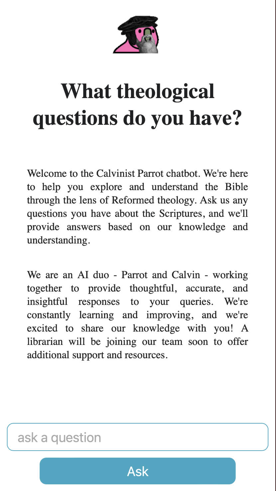

# Calvinist Parrot Chatbot

Calvinist Parrot is an AI-driven chatbot designed to help users explore and understand the Bible through the lens of Reformed theology. This chatbot is powered by two AI agents, Calvinist Parrot and Helping Parrot, which work together to provide thoughtful, accurate, and insightful responses to users' questions.



## Features

- Engaging conversation with two AI agents that collaborate to answer your questions
- AI agents grounded in Reformed theology, with ongoing learning and improvement
- Upcoming addition of a librarian to provide additional support and resources
- Interactive user interface that makes it easy to ask questions and view responses

## Getting Started

### Prerequisites

To run this project, you will need Node.js and npm (the Node.js package manager) installed on your machine.

### Installation

1. Clone the repository:

```bash
git clone git@github.com:Jegama/calvinist-parrot.git
```

2. Change into the project directory:

```bash
cd calvinist-parrot
```

3. Start the development server:

```bash
$ npm install
```

4. Add your [API key](https://platform.openai.com/account/api-keys) to a new file named `.env`.

5. Start the development server:

```bash
$ npm run dev
```

5. Open your web browser and navigate to `http://localhost:3000` to see the chatbot in action.

## Contributing

We welcome contributions to improve the Calvinist Parrot chatbot. If you have ideas, suggestions, or would like to help with development, please open an issue or submit a pull request.


